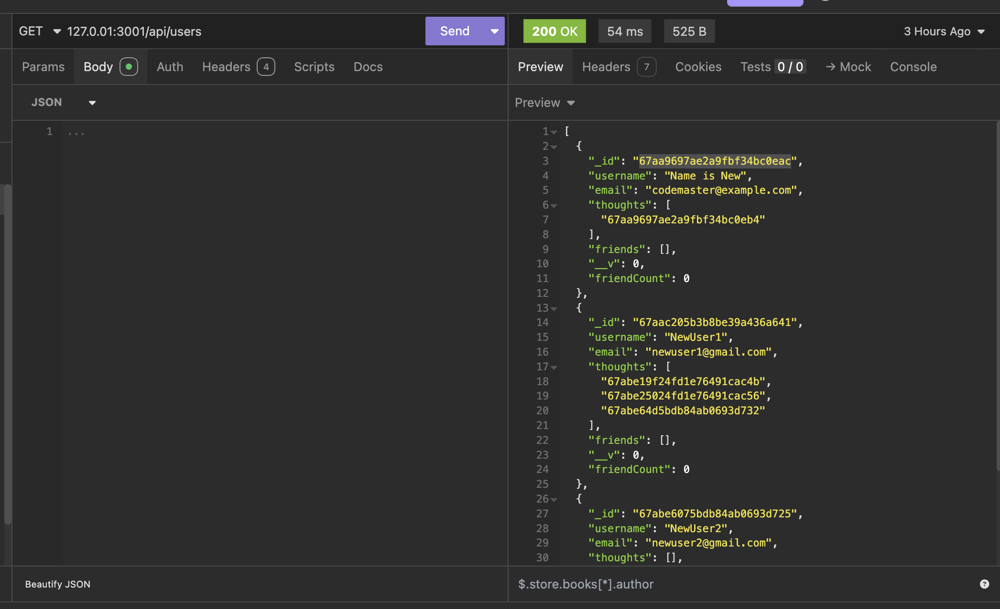
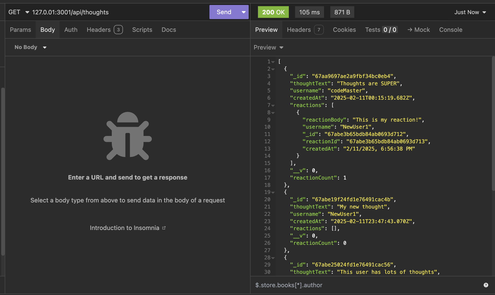
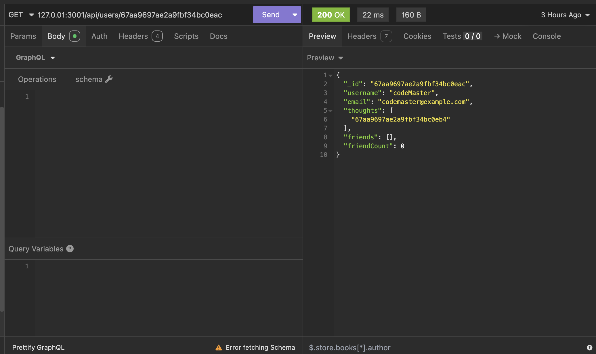
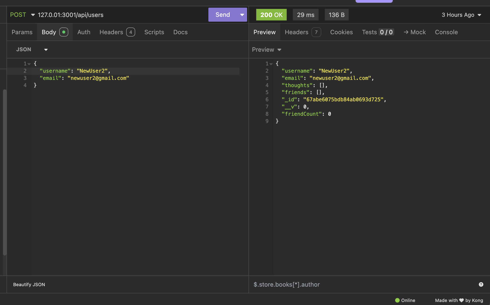
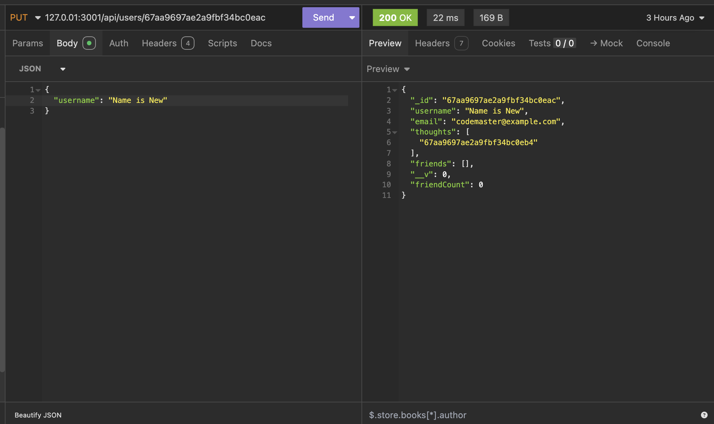
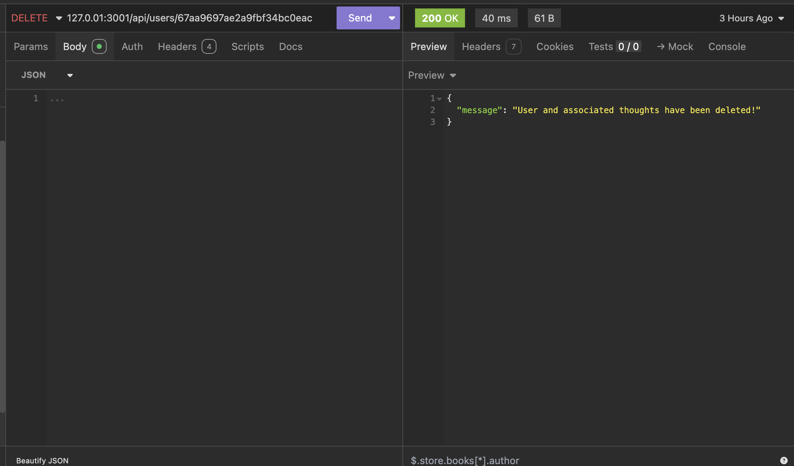

# Kikta_Social_Network
An API built from scratch for a social network web application where users can share their thoughts, react to friends' thoughts, and create a friend list.

## 📚 Description
In this application, Express.js, a MongoDB database, and Mongoose ODM are used to navigates the data created and stored in a social network. 

A video tutorial can be found [here](https://drive.google.com/file/d/1A_XczHEQrfvne-R8MWqjfIUgIhK9obLz/view?usp=sharing) 

## 🚀 Table of Contents
  * [Usage](#📝-Usage)
  * [Features](#⭐-features)
  * [Credits](#🫱🏽‍🫲🏾-credits)
  * [License](#📃-license)
  * [Contact](#🗨️-contact)

## 📝 Usage
<strong>Using the Social Network API</strong>

Here are screenshots of the code tested in Insomnia 

<u><strong>Users</strong></u>

<u><strong>Thoughts</strong></u>

<u><strong>Single User</strong></u>

<u><strong>Create User</strong></u>

<u><strong>Update User</strong></u>

<u><strong>Delete User</strong></u>

Back to [Table-of-Contents](#🚀-table-of-contents)

## ⭐ Features
  * Users share thoughts
  * Users react to friends' thoughts
  * Users create a friend list

Back to [Table-of-Contents](#🚀-table-of-contents)

## 🫱🏽‍🫲🏾 Credits

This applications requires the use of Express.js, MongoDB database, and Mongoose ODM. 

[MongoDB Docs](https://www.mongodb.com/docs/)

Back to [Table-of-Contents](#🚀-table-of-contents)

## 📃 License
This application is unlicensed. 

Back to [Table-of-Contents](#🚀-table-of-contents)

## 🗨️ Contact

  <strong>Email:</strong> [MelissaKikta2025@u.northwestern.edu](mailto:MelissaKikta@u.northwestern.edu)
  
  <strong>GitHub:</strong> [GitHub.com/MelissaKikta](https://github.com/melissakikta)

Back to [Table-of-Contents](#🚀-table-of-contents)

